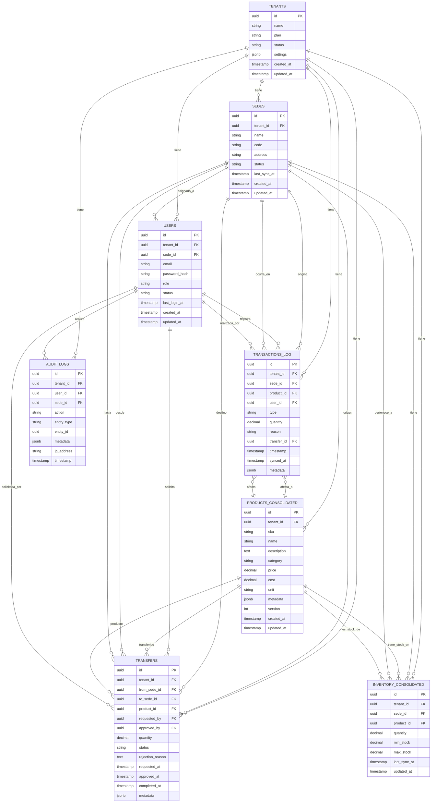
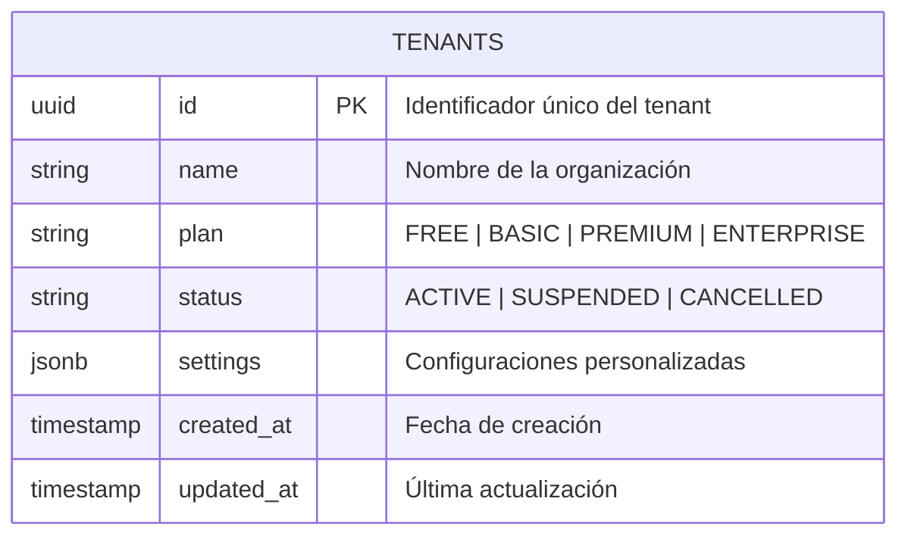
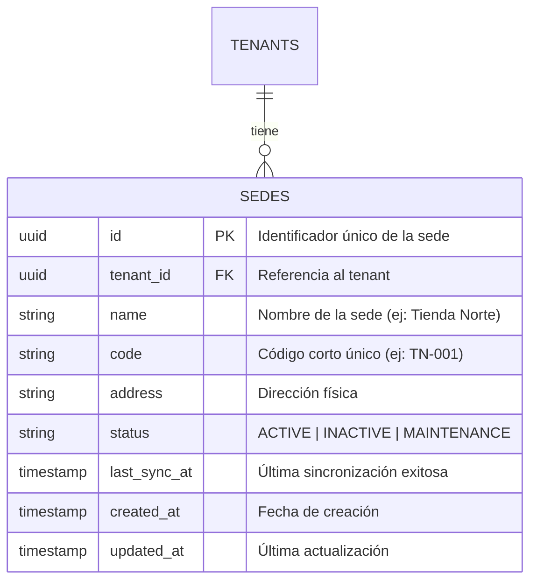
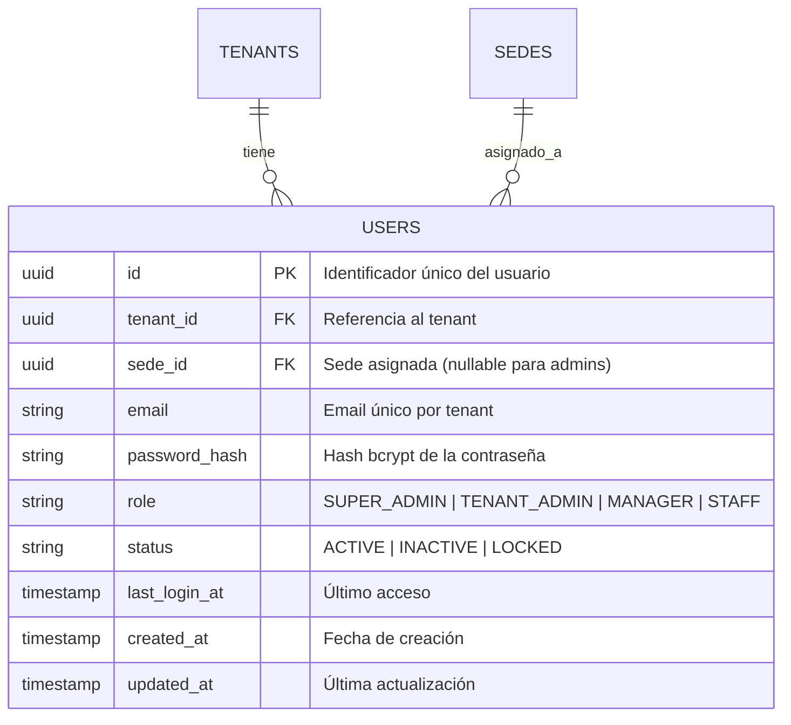
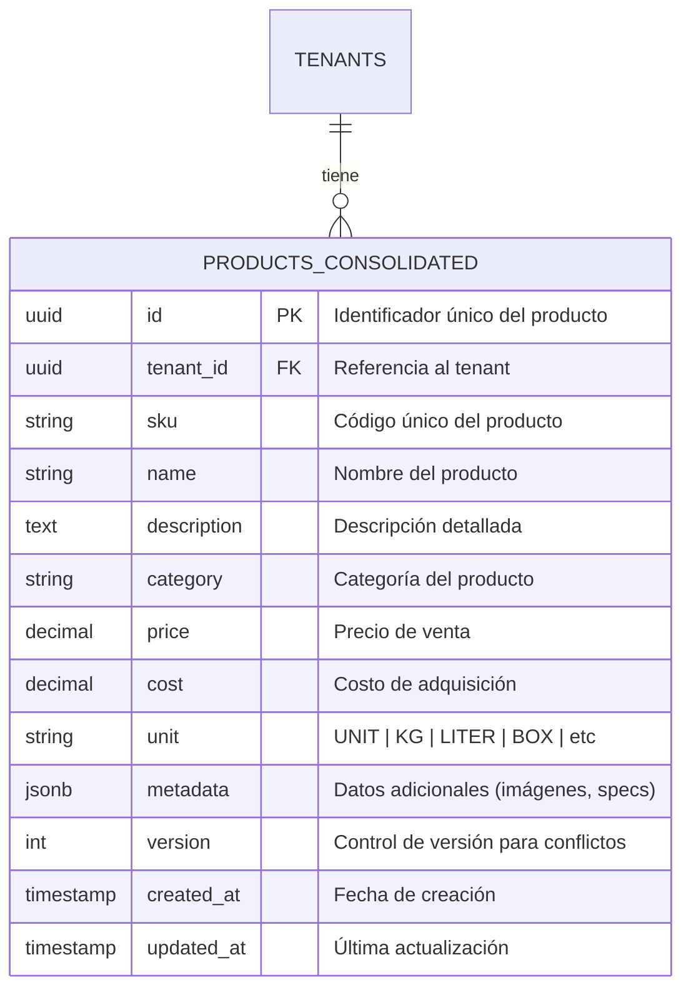
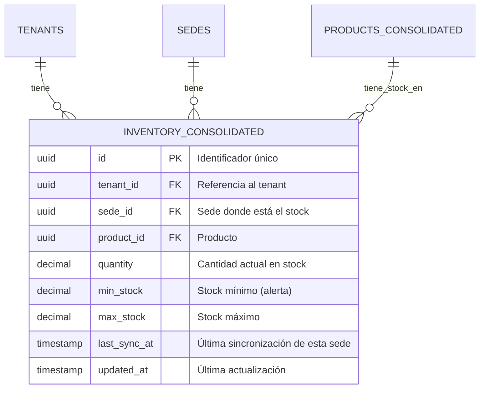
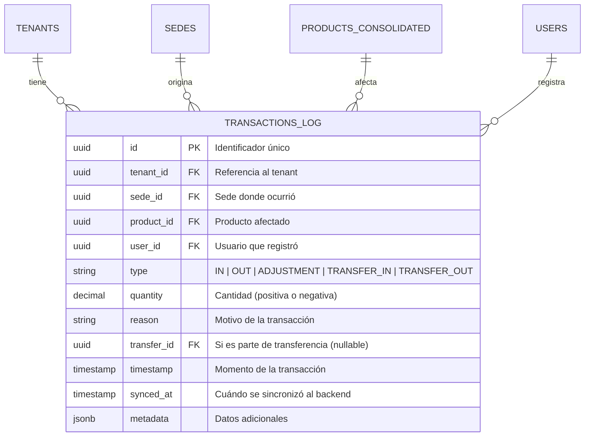
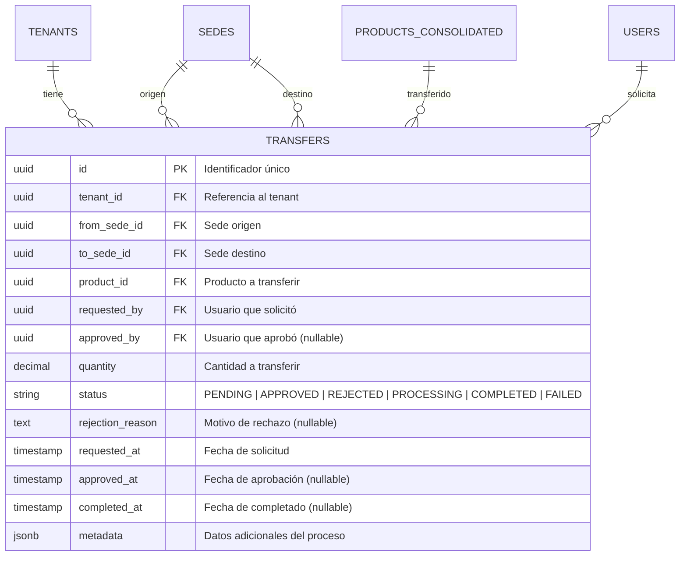
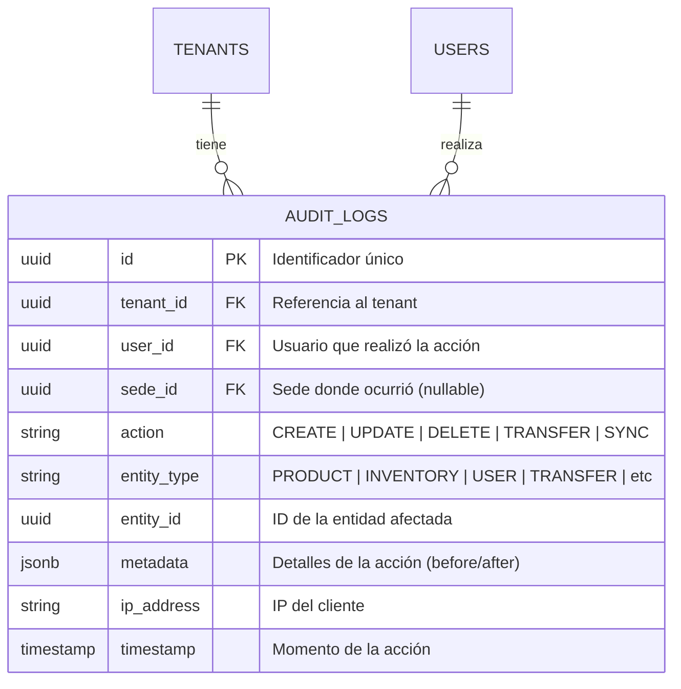

# Diagrama Entidad-Relación (ERD)
## Base de Datos PostgreSQL - Backend Hub

**Proyecto:** NexusInventory  
**Versión:** 1.0  
**Última actualización:** 2026-02-07

---

## Introducción

Este documento describe el esquema completo de la base de datos relacional PostgreSQL que actúa como **hub centralizado** del sistema NexusInventory. Esta base de datos almacena:

- **Vistas consolidadas** del inventario de todas las sedes
- **Coordinación** de transferencias entre sedes
- **Auditoría** completa de operaciones
- **Configuración** multi-tenant

**Importante:** Esta NO es la base de datos operativa de cada sede. Cada sede mantiene su propia base de datos local en IndexedDB (ver documento separado).

---

## Diagrama Completo de Relaciones



---

## Entidades Principales

### 1. TENANTS

**Descripción:** Representa cada organización/empresa que usa el sistema (multi-tenancy).



**Campos clave:**
- `plan`: Determina límites de sedes, usuarios, productos
- `settings`: JSON flexible para configuraciones específicas del tenant (logo, colores, políticas de stock, etc.)
- `status`: Control de suscripción activa

**Relaciones:**
- Un tenant tiene múltiples sedes, usuarios, productos, etc.

---

### 2. SEDES

**Descripción:** Sucursales, tiendas o puntos de venta de cada tenant. Cada sede tiene su propia base de datos local.



**Campos clave:**
- `code`: Código corto para identificación rápida (ej: "TN-001", "TS-002")
- `last_sync_at`: **Crítico** para saber qué tan actualizada está la información de esta sede en reportes consolidados
- `status`: Permite desactivar sedes temporalmente

**Relaciones:**
- Pertenece a un tenant
- Tiene usuarios asignados
- Tiene inventario propio
- Origina transacciones
- Participa en transferencias (como origen o destino)

---

### 3. USERS

**Descripción:** Usuarios del sistema con roles y permisos (RBAC).



**Campos clave:**
- `sede_id`: Nullable para TENANT_ADMIN que puede ver todas las sedes
- `role`: Define permisos en el sistema
  - `SUPER_ADMIN`: Acceso global (plataforma)
  - `TENANT_ADMIN`: Acceso a todas las sedes de su tenant
  - `MANAGER`: Gestión de su sede
  - `STAFF`: Operaciones básicas en su sede
- `password_hash`: Nunca se almacena la contraseña en texto plano

**Autenticación:**
- Login genera JWT con: `{ userId, tenantId, sedeId, role, exp }`
- Token se almacena en localStorage del cliente
- Permite operación offline con validación local de permisos

---

### 4. PRODUCTS_CONSOLIDATED

**Descripción:** Catálogo maestro de productos del tenant. Se sincroniza desde las sedes.



**Campos clave:**
- `sku`: Código único del producto (ej: "LAP-HP-001")
- `version`: Incrementa con cada actualización, usado para resolver conflictos (Last-Write-Wins)
- `metadata`: JSON para datos flexibles (URLs de imágenes, especificaciones técnicas, códigos de barras, etc.)
- `unit`: Unidad de medida para cálculos de inventario

**Normalización con IA:**
- El módulo AI Normalizer sugiere unificación de productos similares
- Todas las sugerencias requieren aprobación humana

---

### 5. INVENTORY_CONSOLIDATED

**Descripción:** Vista consolidada del stock actual de cada producto en cada sede. Se actualiza con cada sincronización.



**Campos clave:**
- `quantity`: Stock actual calculado desde TRANSACTIONS_LOG
- `min_stock` / `max_stock`: Para alertas de reabastecimiento
- `last_sync_at`: Indica qué tan actualizado está este dato

**Ejemplo de datos:**
```
┌──────────┬────────┬────────────┬──────────┬──────────────┐
│ tenantId │ sedeId │ productId  │ quantity │ lastSyncAt   │
├──────────┼────────┼────────────┼──────────┼──────────────┤
│ emp-x    │ sede-a │ prod-123   │ 93       │ 2026-02-07   │
│ emp-x    │ sede-b │ prod-123   │ 150      │ 2026-02-07   │
│ emp-x    │ sede-c │ prod-123   │ 45       │ 2026-02-06   │ ← Desactualizado
└──────────┴────────┴────────────┴──────────┴──────────────┘
Total consolidado: 288 unidades
```

**Caché con Redis:**
- Los totales agregados se cachean en Redis para reportes rápidos
- Se invalida cuando una sede sincroniza

---

### 6. TRANSACTIONS_LOG

**Descripción:** Log inmutable (append-only) de todas las transacciones de inventario. Nunca se modifica ni elimina.



**Campos clave:**
- `type`: Tipo de movimiento
  - `IN`: Entrada de inventario (compra, devolución)
  - `OUT`: Salida de inventario (venta, pérdida)
  - `ADJUSTMENT`: Ajuste manual
  - `TRANSFER_IN`: Recepción desde otra sede
  - `TRANSFER_OUT`: Envío a otra sede
- `transfer_id`: Vincula transacciones que son parte de una transferencia entre sedes
- `timestamp`: Cuándo ocurrió realmente (puede ser offline)
- `synced_at`: Cuándo llegó al backend

**Append-Only:**
- Nunca se modifica ni elimina
- Evita conflictos en sincronización
- Auditoría completa
- El stock se calcula sumando/restando todas las transacciones

**Ejemplo:**
```
ID    | Type          | Quantity | Timestamp           | Synced At
------|---------------|----------|---------------------|--------------------
tx-1  | IN            | +100     | 2026-02-07 08:00    | 2026-02-07 08:01
tx-2  | OUT           | -5       | 2026-02-07 09:00    | 2026-02-07 10:30 ← Offline
tx-3  | ADJUSTMENT    | -2       | 2026-02-07 10:00    | 2026-02-07 10:30 ← Offline
tx-4  | TRANSFER_OUT  | -20      | 2026-02-07 11:00    | 2026-02-07 11:00

Stock actual = 100 - 5 - 2 - 20 = 73 unidades
```

---

### 7. TRANSFERS

**Descripción:** Gestión de transferencias de inventario entre sedes. Requiere coordinación y aprobación.



**Campos clave:**
- `status`: Máquina de estados
  ```
  PENDING → APPROVED → PROCESSING → COMPLETED
     ↓
  REJECTED
     ↓
  FAILED (si algo sale mal durante PROCESSING)
  ```
- `approved_by`: Usuario que aprobó (generalmente Manager de sede origen)
- `rejection_reason`: Obligatorio si status = REJECTED

**Flujo de transferencia (operación atómica):**

1. **Solicitud** (PENDING):
   - Tenant Admin o Manager de sede destino solicita productos
   - Sistema valida que ambas sedes estén online

2. **Aprobación** (APPROVED):
   - Manager de sede origen valida stock disponible
   - Aprueba o rechaza

3. **Procesamiento** (PROCESSING):
   - Backend crea job en BullMQ
   - Ejecuta transacción atómica en PostgreSQL:
     - Crea TRANSACTION_LOG tipo TRANSFER_OUT en sede origen
     - Crea TRANSACTION_LOG tipo TRANSFER_IN en sede destino
     - Actualiza INVENTORY_CONSOLIDATED de ambas sedes

4. **Completado** (COMPLETED):
   - Notifica a ambas sedes vía WebSocket
   - Sedes actualizan su IndexedDB local
   - Invalida caché de Redis

**Garantía de atomicidad:**
- Si falla cualquier paso, se hace rollback completo
- No puede quedar inventario "perdido" o "duplicado"

---

### 8. AUDIT_LOGS

**Descripción:** Registro inmutable de todas las acciones importantes en el sistema para auditoría y trazabilidad.



**Campos clave:**
- `action`: Tipo de acción realizada
- `entity_type` + `entity_id`: Qué fue afectado
- `metadata`: JSON con detalles (valores antes/después, razón, etc.)
- `ip_address`: Para seguridad y detección de accesos sospechosos

**Ejemplo de metadata:**
```json
{
  "before": { "quantity": 100 },
  "after": { "quantity": 80 },
  "reason": "Ajuste por inventario físico",
  "userAgent": "Mozilla/5.0..."
}
```

**Usos:**
- Auditoría de cambios
- Resolución de conflictos
- Detección de fraudes
- Cumplimiento regulatorio
- Debugging de sincronización

---

## Decisiones de Diseño Clave

### 1. Multi-Tenancy

**Aislamiento total entre tenants:**
- Todas las tablas tienen `tenant_id`
- PostgreSQL Row-Level Security (RLS) garantiza que ningún tenant acceda a datos de otro
- Prisma middleware inyecta `tenant_id` automáticamente en todas las queries
- NestJS guards validan `user.tenantId === resource.tenantId`

### 2. Consistencia Híbrida

**Eventual para operaciones locales:**
- Ventas, entradas, ajustes se ejecutan localmente
- Se sincronizan después cuando hay conexión
- Last-Write-Wins para conflictos basado en timestamp del servidor

**Fuerte para transferencias inter-sede:**
- Requiere ambas sedes online
- Validación en tiempo real
- Ejecución atómica con transacciones ACID

### 3. Append-Only para Transacciones

**Ventajas:**
- Evita conflictos de sincronización
- Auditoría completa e inmutable
- Cálculo de stock siempre consistente
- Permite reconstruir estado en cualquier momento

**Implementación:**
- Nunca se hace UPDATE ni DELETE en TRANSACTIONS_LOG
- Solo INSERT
- Stock actual = SUM(quantity) WHERE product_id = X

### 4. Vistas Consolidadas vs Datos Operativos

**Backend almacena vistas, no operación:**
- `INVENTORY_CONSOLIDATED`: Resumen del stock de cada sede
- `PRODUCTS_CONSOLIDATED`: Catálogo maestro sincronizado
- `TRANSACTIONS_LOG`: Copia de transacciones para reportes

**Sedes almacenan datos operativos:**
- IndexedDB tiene la base de datos completa y funcional
- Backend es para visibilidad y coordinación, no para operación diaria

---

## Índices Recomendados

```sql
-- Multi-tenancy (todas las queries filtran por tenant)
CREATE INDEX idx_sedes_tenant ON sedes(tenant_id);
CREATE INDEX idx_users_tenant ON users(tenant_id);
CREATE INDEX idx_products_tenant ON products_consolidated(tenant_id);
CREATE INDEX idx_inventory_tenant_sede ON inventory_consolidated(tenant_id, sede_id);
CREATE INDEX idx_transactions_tenant_sede ON transactions_log(tenant_id, sede_id);
CREATE INDEX idx_transfers_tenant ON transfers(tenant_id);
CREATE INDEX idx_audit_tenant ON audit_logs(tenant_id);

-- Búsquedas frecuentes
CREATE INDEX idx_products_sku ON products_consolidated(tenant_id, sku);
CREATE INDEX idx_users_email ON users(tenant_id, email);
CREATE INDEX idx_inventory_product ON inventory_consolidated(product_id);
CREATE INDEX idx_transactions_timestamp ON transactions_log(timestamp DESC);
CREATE INDEX idx_transfers_status ON transfers(status);

-- Sincronización
CREATE INDEX idx_sedes_last_sync ON sedes(last_sync_at);
CREATE INDEX idx_transactions_synced ON transactions_log(synced_at);
CREATE INDEX idx_inventory_last_sync ON inventory_consolidated(last_sync_at);

-- Auditoría
CREATE INDEX idx_audit_user ON audit_logs(user_id);
CREATE INDEX idx_audit_entity ON audit_logs(entity_type, entity_id);
CREATE INDEX idx_audit_timestamp ON audit_logs(timestamp DESC);
```

---

## Constraints y Validaciones

```sql
-- Validaciones de negocio
ALTER TABLE inventory_consolidated 
  ADD CONSTRAINT quantity_non_negative CHECK (quantity >= 0);

ALTER TABLE transfers 
  ADD CONSTRAINT different_sedes CHECK (from_sede_id != to_sede_id);

ALTER TABLE transfers 
  ADD CONSTRAINT quantity_positive CHECK (quantity > 0);

-- Enums
ALTER TABLE users 
  ADD CONSTRAINT valid_role CHECK (role IN ('SUPER_ADMIN', 'TENANT_ADMIN', 'MANAGER', 'STAFF'));

ALTER TABLE users 
  ADD CONSTRAINT valid_status CHECK (status IN ('ACTIVE', 'INACTIVE', 'LOCKED'));

ALTER TABLE tenants 
  ADD CONSTRAINT valid_plan CHECK (plan IN ('FREE', 'BASIC', 'PREMIUM', 'ENTERPRISE'));

ALTER TABLE sedes 
  ADD CONSTRAINT valid_status CHECK (status IN ('ACTIVE', 'INACTIVE', 'MAINTENANCE'));

ALTER TABLE transactions_log 
  ADD CONSTRAINT valid_type CHECK (type IN ('IN', 'OUT', 'ADJUSTMENT', 'TRANSFER_IN', 'TRANSFER_OUT'));

ALTER TABLE transfers 
  ADD CONSTRAINT valid_status CHECK (status IN ('PENDING', 'APPROVED', 'REJECTED', 'PROCESSING', 'COMPLETED', 'FAILED'));

-- Unique constraints
ALTER TABLE products_consolidated 
  ADD CONSTRAINT unique_sku_per_tenant UNIQUE (tenant_id, sku);

ALTER TABLE users 
  ADD CONSTRAINT unique_email_per_tenant UNIQUE (tenant_id, email);

ALTER TABLE sedes 
  ADD CONSTRAINT unique_code_per_tenant UNIQUE (tenant_id, code);

-- Foreign keys con cascadas
ALTER TABLE sedes 
  ADD CONSTRAINT fk_sedes_tenant 
  FOREIGN KEY (tenant_id) REFERENCES tenants(id) ON DELETE CASCADE;

ALTER TABLE users 
  ADD CONSTRAINT fk_users_tenant 
  FOREIGN KEY (tenant_id) REFERENCES tenants(id) ON DELETE CASCADE;

ALTER TABLE users 
  ADD CONSTRAINT fk_users_sede 
  FOREIGN KEY (sede_id) REFERENCES sedes(id) ON DELETE SET NULL;

-- Etc. para todas las relaciones
```

---

## Queries Importantes

### Reporte consolidado de inventario

```sql
SELECT 
  p.name,
  p.sku,
  s.name as sede_name,
  i.quantity,
  i.last_sync_at,
  CASE 
    WHEN i.last_sync_at < NOW() - INTERVAL '2 hours' THEN 'DESACTUALIZADO'
    ELSE 'ACTUALIZADO'
  END as sync_status
FROM inventory_consolidated i
JOIN products_consolidated p ON i.product_id = p.id
JOIN sedes s ON i.sede_id = s.id
WHERE i.tenant_id = :tenantId
ORDER BY p.name, s.name;
```

### Total de stock por producto (todas las sedes)

```sql
SELECT 
  p.id,
  p.name,
  p.sku,
  SUM(i.quantity) as total_quantity,
  COUNT(DISTINCT i.sede_id) as sedes_con_stock,
  MAX(i.last_sync_at) as ultima_sync
FROM products_consolidated p
LEFT JOIN inventory_consolidated i ON p.id = i.product_id
WHERE p.tenant_id = :tenantId
GROUP BY p.id, p.name, p.sku
ORDER BY total_quantity DESC;
```

### Transferencias pendientes de aprobación

```sql
SELECT 
  t.id,
  t.quantity,
  p.name as product_name,
  s_from.name as from_sede,
  s_to.name as to_sede,
  u.email as requested_by,
  t.requested_at
FROM transfers t
JOIN products_consolidated p ON t.product_id = p.id
JOIN sedes s_from ON t.from_sede_id = s_from.id
JOIN sedes s_to ON t.to_sede_id = s_to.id
JOIN users u ON t.requested_by = u.id
WHERE t.tenant_id = :tenantId
  AND t.status = 'PENDING'
ORDER BY t.requested_at ASC;
```

---

## Próximos Pasos

1. **Implementar schema con Prisma** - Definir el schema.prisma completo
2. **Configurar Row-Level Security** - Políticas de PostgreSQL para multi-tenancy
3. **Crear seeds de datos** - Datos de prueba para desarrollo
4. **Definir schema de IndexedDB** - Base de datos local de cada sede (documento separado)
5. **Documentar protocolo de sincronización** - Cómo se mantienen consistentes ambas bases de datos

---

## Glosario

- **ACID**: Atomicity, Consistency, Isolation, Durability - Propiedades de transacciones confiables
- **Append-Only**: Solo agregar, nunca modificar ni eliminar
- **ERD**: Entity-Relationship Diagram
- **FK**: Foreign Key (clave foránea)
- **JWT**: JSON Web Token - Token de autenticación
- **PK**: Primary Key (clave primaria)
- **RBAC**: Role-Based Access Control - Control de acceso basado en roles
- **RLS**: Row-Level Security - Seguridad a nivel de fila en PostgreSQL
- **Tenant**: Organización/empresa que usa el sistema
- **Vista Consolidada**: Resumen agregado de datos de múltiples sedes
