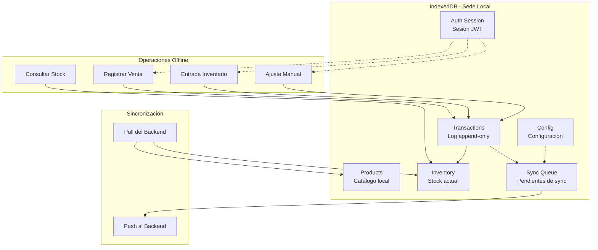
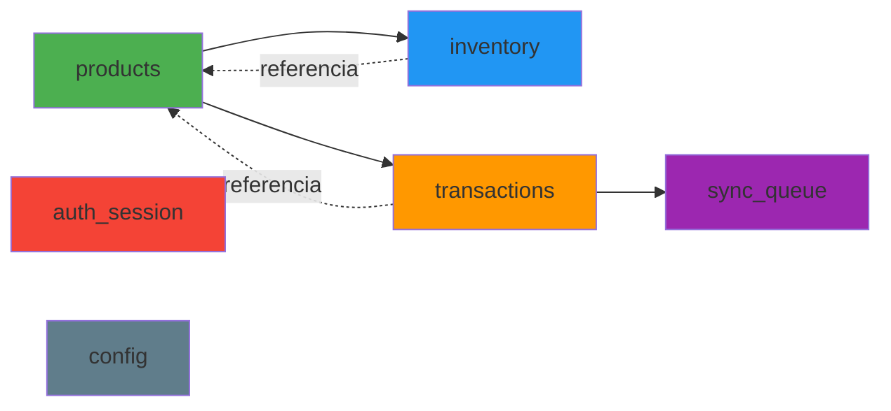
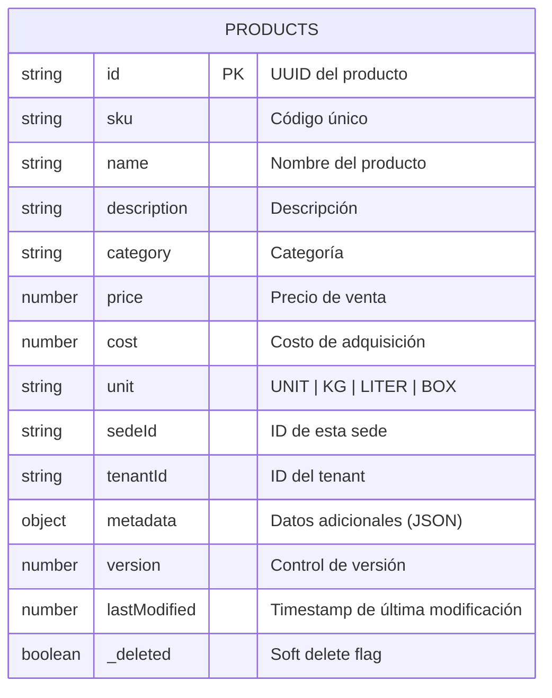
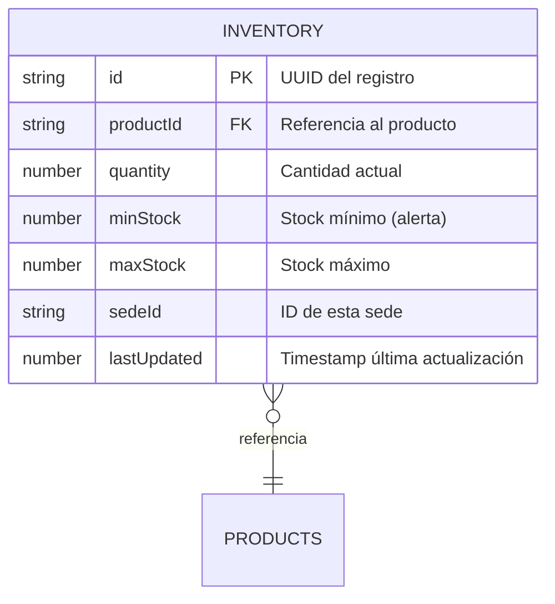
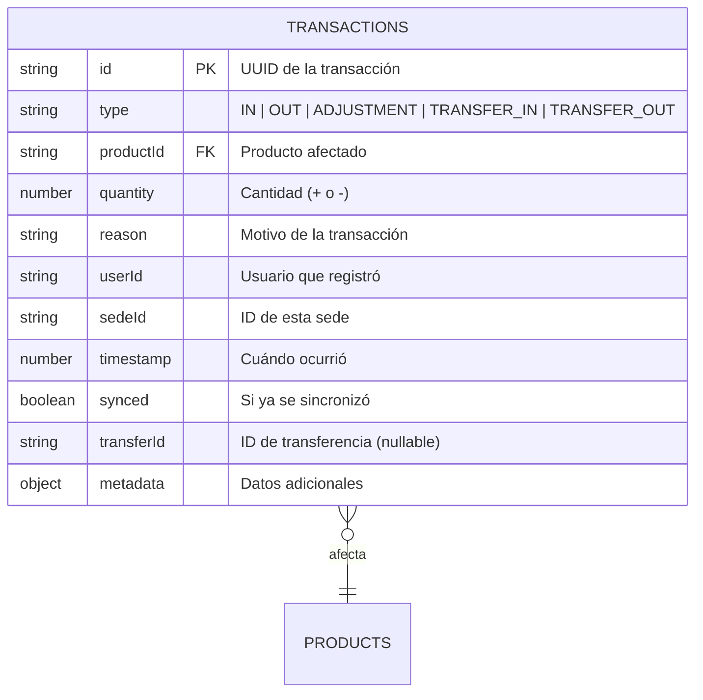
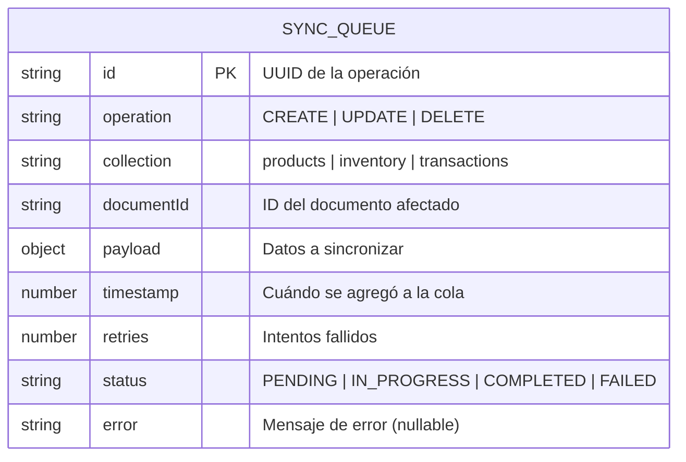
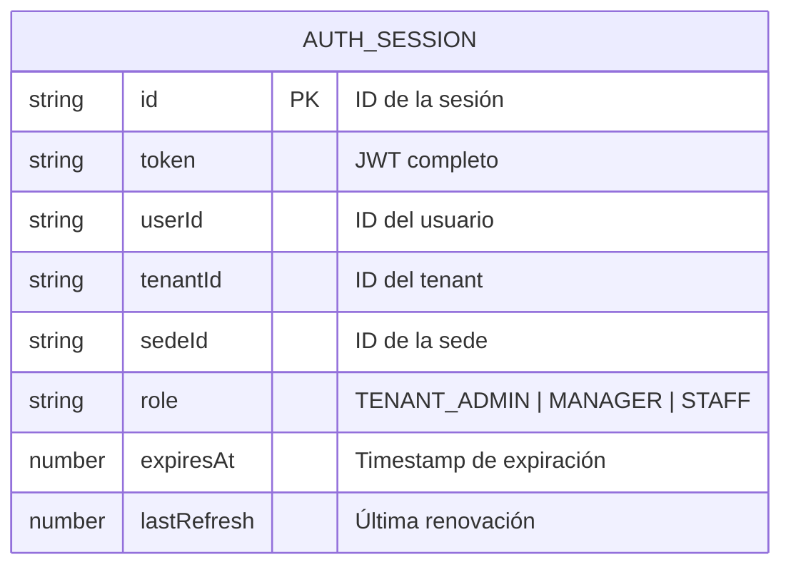
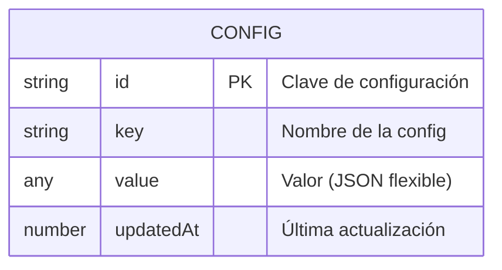

# Schema IndexedDB con RxDB
## Base de Datos Local por Sede

**Proyecto:** NexusInventory  
**Versión:** 1.0  
**Última actualización:** 2026-02-07

---

## Introducción

Este documento describe el esquema completo de la base de datos local que cada sede mantiene en **IndexedDB** usando **RxDB**. Esta base de datos:

- Es la **fuente de verdad** para operaciones locales de la sede
- Permite operación **100% offline** sin depender del backend
- Se sincroniza de forma **eventual** con el backend PostgreSQL
- **NO es un caché** - es una base de datos completa y funcional

### Diferencias clave con PostgreSQL

| Aspecto | PostgreSQL (Backend Hub) | IndexedDB (Sede Local) |
|---------|--------------------------|------------------------|
| **Tipo** | Relacional (SQL) | NoSQL (Key-Value + Índices) |
| **Relaciones** | Foreign Keys explícitas | Referencias por ID |
| **Joins** | SQL nativo | Manual en código JavaScript |
| **Propósito** | Agregación multi-sede | Operación local rápida |
| **Datos** | Vistas consolidadas | Datos operativos completos |
| **Alcance** | Todos los tenants | Solo una sede |

---

## Arquitectura de Datos Local



---

## Colecciones RxDB

### Visión General



---

## 1. Products (Catálogo Local)

**Descripción:** Catálogo completo de productos disponibles en esta sede. Se sincroniza bidireccionalmente con el backend.



### Schema RxDB (TypeScript)

```typescript
export const productSchema = {
  version: 0,
  primaryKey: 'id',
  type: 'object',
  properties: {
    id: {
      type: 'string',
      maxLength: 36
    },
    sku: {
      type: 'string',
      maxLength: 50
    },
    name: {
      type: 'string',
      maxLength: 200
    },
    description: {
      type: 'string',
      maxLength: 1000
    },
    category: {
      type: 'string',
      maxLength: 100
    },
    price: {
      type: 'number',
      minimum: 0
    },
    cost: {
      type: 'number',
      minimum: 0
    },
    unit: {
      type: 'string',
      enum: ['UNIT', 'KG', 'LITER', 'BOX', 'PACK', 'METER']
    },
    sedeId: {
      type: 'string',
      maxLength: 36
    },
    tenantId: {
      type: 'string',
      maxLength: 36
    },
    metadata: {
      type: 'object'
    },
    version: {
      type: 'number',
      minimum: 0,
      default: 1
    },
    lastModified: {
      type: 'number'
    },
    _deleted: {
      type: 'boolean',
      default: false
    }
  },
  required: ['id', 'sku', 'name', 'sedeId', 'tenantId'],
  indexes: ['sku', 'category', 'lastModified']
};
```

### Campos Clave

- **`id`**: UUID generado localmente o recibido del backend
- **`sku`**: Código único del producto (ej: "LAP-HP-001")
- **`version`**: Incrementa con cada modificación, usado para resolver conflictos (Last-Write-Wins)
- **`lastModified`**: Timestamp del servidor (no del cliente) para sincronización
- **`_deleted`**: Soft delete - nunca se elimina físicamente, solo se marca
- **`metadata`**: JSON flexible para imágenes, códigos de barras, especificaciones


## 2. Inventory (Stock Actual)

**Descripción:** Stock actual de cada producto en esta sede. Se calcula desde las transacciones y se mantiene actualizado.



### Schema RxDB (TypeScript)

```typescript
export const inventorySchema = {
  version: 0,
  primaryKey: 'id',
  type: 'object',
  properties: {
    id: {
      type: 'string',
      maxLength: 36
    },
    productId: {
      type: 'string',
      maxLength: 36,
      ref: 'products' // Referencia a colección products
    },
    quantity: {
      type: 'number',
      minimum: 0,
      default: 0
    },
    minStock: {
      type: 'number',
      minimum: 0,
      default: 0
    },
    maxStock: {
      type: 'number',
      minimum: 0,
      default: 0
    },
    sedeId: {
      type: 'string',
      maxLength: 36
    },
    lastUpdated: {
      type: 'number'
    }
  },
  required: ['id', 'productId', 'sedeId'],
  indexes: ['productId', 'lastUpdated']
};
```

### Campos Clave

- **`productId`**: Referencia al producto (no es foreign key, solo ID)
- **`quantity`**: Stock actual calculado desde transacciones
- **`minStock` / `maxStock`**: Para alertas de reabastecimiento
- **`lastUpdated`**: Última vez que cambió el stock


## 3. Transactions (Log Append-Only)

**Descripción:** Log inmutable de todas las transacciones de inventario. Nunca se modifica ni elimina.



### Schema RxDB (TypeScript)

```typescript
export const transactionSchema = {
  version: 0,
  primaryKey: 'id',
  type: 'object',
  properties: {
    id: {
      type: 'string',
      maxLength: 36
    },
    type: {
      type: 'string',
      enum: ['IN', 'OUT', 'ADJUSTMENT', 'TRANSFER_IN', 'TRANSFER_OUT']
    },
    productId: {
      type: 'string',
      maxLength: 36,
      ref: 'products'
    },
    quantity: {
      type: 'number'
    },
    reason: {
      type: 'string',
      maxLength: 500
    },
    userId: {
      type: 'string',
      maxLength: 36
    },
    sedeId: {
      type: 'string',
      maxLength: 36
    },
    timestamp: {
      type: 'number'
    },
    synced: {
      type: 'boolean',
      default: false
    },
    transferId: {
      type: 'string',
      maxLength: 36
    },
    metadata: {
      type: 'object'
    }
  },
  required: ['id', 'type', 'productId', 'quantity', 'sedeId', 'timestamp'],
  indexes: ['timestamp', 'synced', 'productId', 'type']
};
```

### Campos Clave

- **`type`**: Tipo de movimiento
  - `IN`: Entrada (compra, devolución de cliente)
  - `OUT`: Salida (venta, pérdida)
  - `ADJUSTMENT`: Ajuste manual de inventario
  - `TRANSFER_IN`: Recepción desde otra sede
  - `TRANSFER_OUT`: Envío a otra sede
- **`quantity`**: Puede ser positivo o negativo según el tipo
- **`synced`**: **Crítico** - indica si ya se envió al backend
- **`transferId`**: Vincula transacciones que son parte de una transferencia

## 4. Sync Queue (Cola de Sincronización)

**Descripción:** Cola de operaciones pendientes de sincronizar con el backend. Se procesa cuando hay conexión.



### Schema RxDB (TypeScript)

```typescript
export const syncQueueSchema = {
  version: 0,
  primaryKey: 'id',
  type: 'object',
  properties: {
    id: {
      type: 'string',
      maxLength: 36
    },
    operation: {
      type: 'string',
      enum: ['CREATE', 'UPDATE', 'DELETE']
    },
    collection: {
      type: 'string',
      enum: ['products', 'inventory', 'transactions']
    },
    documentId: {
      type: 'string',
      maxLength: 36
    },
    payload: {
      type: 'object'
    },
    timestamp: {
      type: 'number'
    },
    retries: {
      type: 'number',
      minimum: 0,
      default: 0
    },
    status: {
      type: 'string',
      enum: ['PENDING', 'IN_PROGRESS', 'COMPLETED', 'FAILED'],
      default: 'PENDING'
    },
    error: {
      type: 'string',
      maxLength: 500
    }
  },
  required: ['id', 'operation', 'collection', 'documentId', 'payload', 'timestamp'],
  indexes: ['status', 'timestamp']
};
```

### Campos Clave

- **`operation`**: Qué hacer con el documento
- **`collection`**: En qué colección está el documento
- **`payload`**: Los datos completos a sincronizar
- **`retries`**: Contador de intentos fallidos (máximo 3-5)
- **`status`**: Estado de la sincronización


## 5. Auth Session (Autenticar Sesión)

**Descripción:** Almacena la sesión JWT del usuario para operación offline y validación local de permisos.



### Schema RxDB (TypeScript)

```typescript
export const authSessionSchema = {
  version: 0,
  primaryKey: 'id',
  type: 'object',
  properties: {
    id: {
      type: 'string',
      maxLength: 36
    },
    token: {
      type: 'string',
      maxLength: 2000
    },
    userId: {
      type: 'string',
      maxLength: 36
    },
    tenantId: {
      type: 'string',
      maxLength: 36
    },
    sedeId: {
      type: 'string',
      maxLength: 36
    },
    role: {
      type: 'string',
      enum: ['SUPER_ADMIN', 'TENANT_ADMIN', 'MANAGER', 'STAFF']
    },
    expiresAt: {
      type: 'number'
    },
    lastRefresh: {
      type: 'number'
    }
  },
  required: ['id', 'token', 'userId', 'tenantId', 'sedeId', 'role', 'expiresAt']
};
```

## 6. Config (Configuración Local)

**Descripción:** Configuraciones y metadatos de la sede almacenados localmente.



### Schema RxDB (TypeScript)

```typescript
export const configSchema = {
  version: 0,
  primaryKey: 'id',
  type: 'object',
  properties: {
    id: {
      type: 'string',
      maxLength: 100
    },
    key: {
      type: 'string',
      maxLength: 100
    },
    value: {
      type: ['string', 'number', 'boolean', 'object', 'array']
    },
    updatedAt: {
      type: 'number'
    }
  },
  required: ['id', 'key', 'value']
};
```

